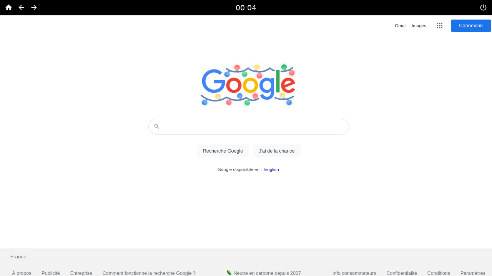

# Home

> Your grandparents' distribution

Papy Linux (/papi linyks/, from the french "papy" which means "grandfather") is a distribution I made for my grandfather so that he can use his computer easily and without unexpected behaviours. It's a web-only distribution, Firefox is started at boot, can't be closed and you can't open any other application.

